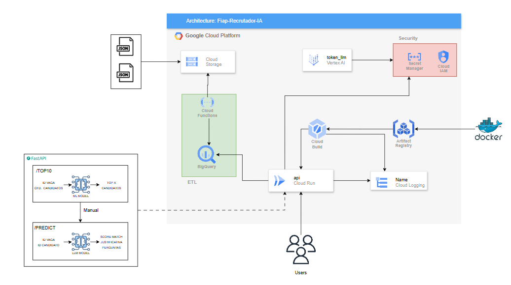

# FIAP Recrutador IA

Este projeto é uma aplicação de recrutamento que utiliza inteligência artificial para otimizar o processo de seleção de candidatos.

# Tecnologias Utilizadas

- Python
- Google Cloud
    - Vertex AI Studio
    - BigQuery
    - Cloud Run
    - Cloud Build
    - Artifactory Registry
- Fast API

## Como Executar

1. **Clone o repositório**
    ```bash
    git clone https://github.com/thaisrcdias/fiap-recrutador-ia.git
    ```

2. **Configure variáveis de ambiente**
    - Crie um arquivo `.env` na pasta raiz.

3. **Instale as dependências**
    ```bash
    python -m pip install -r requirements.txt
    ```

4. **Inicie os serviços**
    Na pasta raiz, execute o comando abaixo:
    ```bash
    uvicorn app.main:app --reload
    ```

## Arquitetura



1. **Ingestão de dados**  
   Arquivos JSON de vagas/candidatos são enviados para o **Cloud Storage**.

2. **ETL**  
   O **Cloud Functions** processa os dados e carrega no **BigQuery**.

3. **API (FastAPI em Cloud Run)**  
   - `/top10`: retorna os 10 melhores candidatos para uma vaga usando um modelo de ML.  
   - `/predict`: gera score de match, justificativa e perguntas de entrevista usando um LLM.  

4. **CI/CD e Containerização**  
   - **Cloud Build** gera imagens Docker.  
   - **Artifact Registry** armazena as imagens.  
   - **Cloud Run** executa a API em escala serverless.  

5. **Segurança e Observabilidade**  
   - **Secret Manager + IAM** protegem o token do LLM (Vertex AI).  
   - **Cloud Logging** centraliza logs e métricas.  

### Benefícios

- Arquitetura **serverless** → escalável e com baixo custo ocioso.  
- **BigQuery** para consultas rápidas e integradas.  
- **CI/CD** automatizado com Cloud Build + Artifact Registry.  
- **Segurança by design** com Secret Manager e IAM.  


# Modelos de IA e IA Gen

## Treinamento do Modelo de IA

O arquivo `train.py` em `scripts/` realiza o treinamento do modelo de IA para análise automática de currículos. Ele processa os dados dos candidatos, faz o pré-processamento e ajusta os parâmetros do modelo para melhorar a precisão das recomendações. Após o treinamento, o modelo pode ser usado para avaliar novos currículos e recomendar candidatos de forma eficiente.

O treinamento é executado pelo arquivo `model_trainer.py` na pasta `src/`, que carrega os dados, realiza o pré-processamento, define os parâmetros e executa o treinamento. Ao final, o modelo treinado é salvo para uso posterior na avaliação dos currículos.

### O que é XGBoost?

XGBoost é uma biblioteca de aprendizado de máquina baseada em árvores de decisão, amplamente utilizada para tarefas de classificação e regressão. Ela é conhecida por sua eficiência, velocidade e alta performance em competições de ciência de dados.

## Construção da LLM

O arquivo `llm.py` em `source/` constrói o avaliador baseado em IA generativa utilizando o Vertex AI. Ele integra o serviço de IA da Google para analisar e avaliar currículos, gerando recomendações inteligentes e personalizadas. O script gerencia a comunicação com o Vertex AI, prepara os dados de entrada e interpreta as respostas do modelo, tornando o processo de avaliação mais eficiente e automatizado.

### O que é o Vertex AI?

Vertex AI é uma plataforma de inteligência artificial da Google Cloud que facilita o desenvolvimento, treinamento, implantação e gerenciamento de modelos de machine learning. Ela oferece ferramentas integradas para automação de workflows, suporte a modelos pré-treinados e customizados, além de recursos avançados para IA generativa. Com o Vertex AI, é possível criar soluções de IA escaláveis e seguras, acelerando o processo de inovação em aplicações empresariais.

## Avaliação dos candidatos

O score gerado pelo modelo tradicional de IA serve para ranquear os candidatos antes da avaliação pela LLM (Large Language Model). Esse ranking inicial garante que apenas os candidatos mais relevantes, segundo critérios objetivos definidos pelo modelo, sejam encaminhados para a análise aprofundada e personalizada realizada pela IA generativa via Vertex AI.

# Funcionalidades

- Rankeamento de currículos em relação à descrição da vaga.
- Avaliação de perfil utilizando IA Generativa.
- Geração de perguntas para o candidato.


## Estrutura do Projeto

```
fiap-recrutador-ia/
├── app/        # Rotas da API do modelo
├──├── main.py
├──├── routes.py
├──├── schemas.py

├── saved_models/         # Arquivo do modelo
├──├── match_model.joblib

├── scripts         # Treinamento do modelo de IA
├──├── register_model.py
├──├── train.py

├── src 
├──├── etl         # Pré processamento dos dados
├──├──├── preprocessing.py
├──├── llm         # Construção e parametrização da LLM
├──├──├── config.py
├──├──├── data.py
├──├──├── llm.py
├──├──├── matcher.py
├──├── __init__.py
├──├── data_loader.py
├──├── model_ranker.py
├──├── model_trainer.py
├──├── preprocessor.py

├── tests         # Testes unitários
├──├── __init__.py
├──├── test_data_loader.py
├──├── test_model_ranker.py
├──├── test_model_trainer.py
├──├── test_preprocessor.py
├──├── test_routes.py
├──├── test_llm_utils.py
├──├── test_llm_matcher.py
├──├── test_llm_data_repo.py

├── Dockerfile
├── requirements.txt
├── README.md
```

## Cobertura dos Testes Unitários


## CI/CD

O deploy da imagem docker no artifactory registry e publicação da api via cloud run, é realizado através do arquivo cloudbuild.yaml

```gcloud builds submit --config cloudbuild.yaml ```

Observação: É preciso estar autenticado na gcp e com o projeto setado.


## Monitoring


- Cloud Logging


